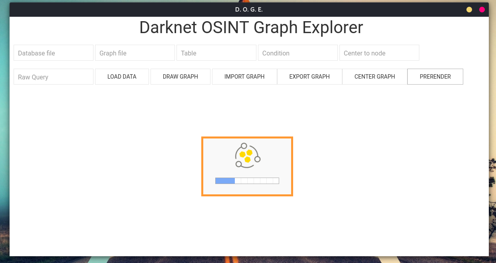
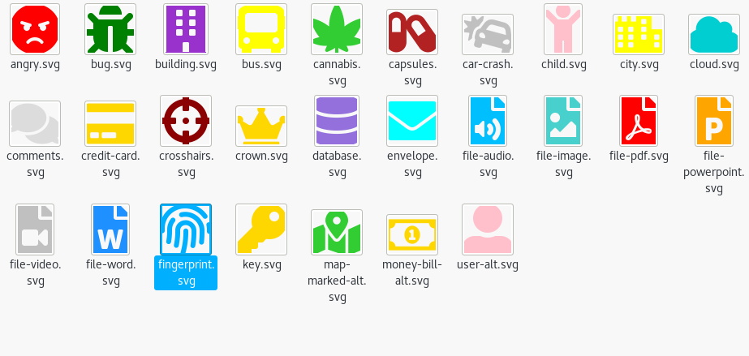
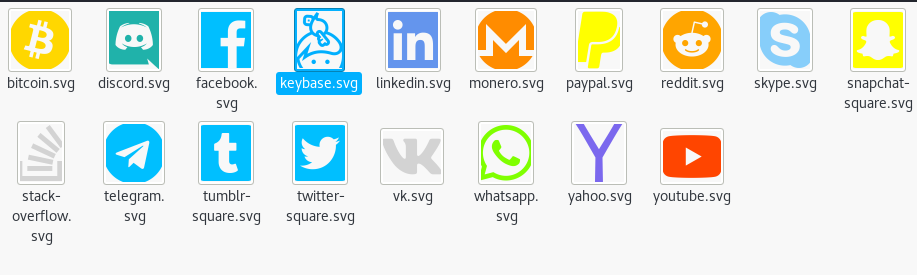
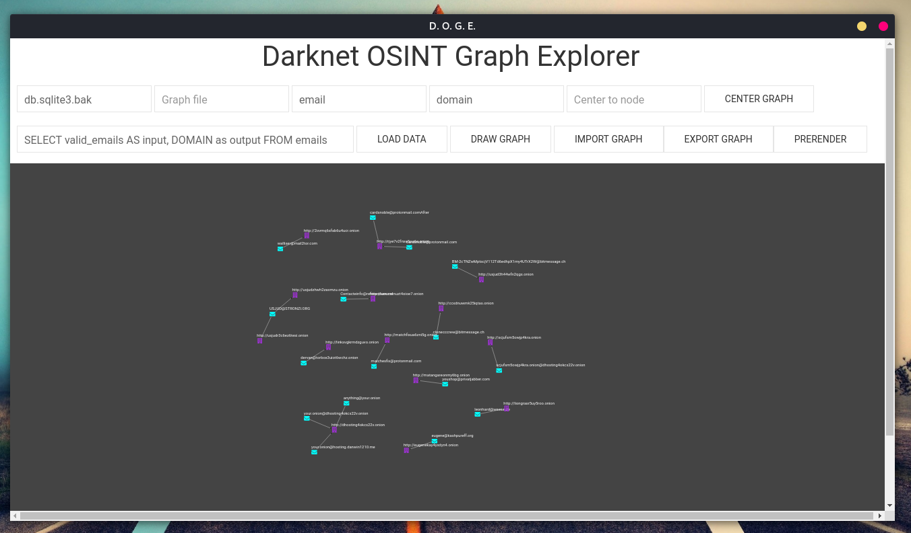
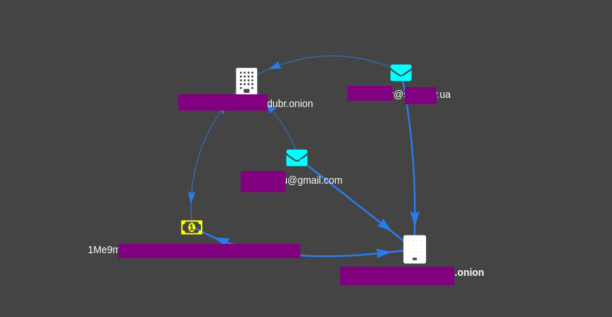
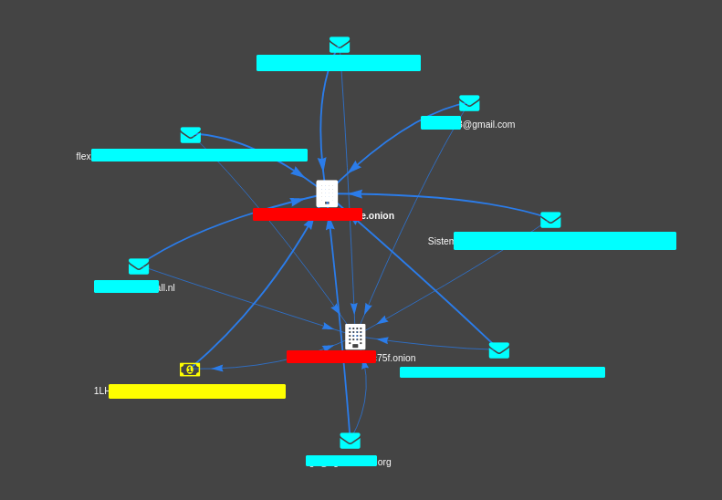
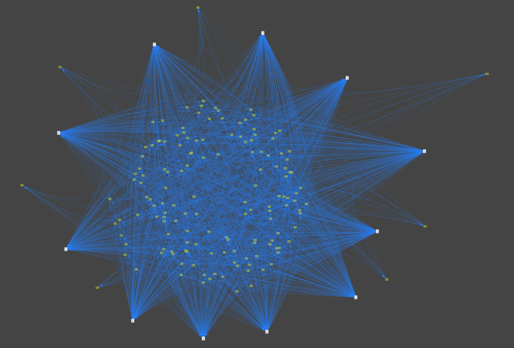

# DOGE
Darknet Osint Graph Explorer

Still in dev, works right.

You should use this in addtion to [Darknet OSINT Transform](https://github.com/pielco11/DOT)

## Pay attention here
Query prototype: SELECT DISTINCT custom_column_name AS input, another_custom_name AS output FROM some_table, obviously you can add other options as WHERE, ORDER BY, etc.

## How-To
`Database file`: the filename of the database (sqlite3), ex: db.sqlite3

`Graph file`: useless (now as now)

Choose the table ("please select"), accepted values are: `emails`,`bitcoins` or `hses`.

`Condition`: type `*` to return every row, otherwise you should insert something like `where domain="some.onion"`

`Raw query`: don't use this, behaviour not handled

`Load Settings`: add data but don't draw, you could use this to import stuff from various databases and when everyting is imported, draw

`Load Graph`: draws nodes with edges

`Import Graph`: useless (now as now)

`Export Graph`: useless (now as now)

`Center to node`: put node id here, then click on `Center Graph` to center the graph to that specific node id

`Prerender`: does not display the graph until the "pre-rendering" process is done, this should be used when you have to graph 100s of nodes, feel free to change parameters:
- 1st argument, `precomputeGraph()`, in `pages/graph_1.html`;
- in the same file, lines 246 and 247.

## Custom icons
Every icon comes from Font Awesome, I just changed colors.

## Screenshots

Stay tuned.
